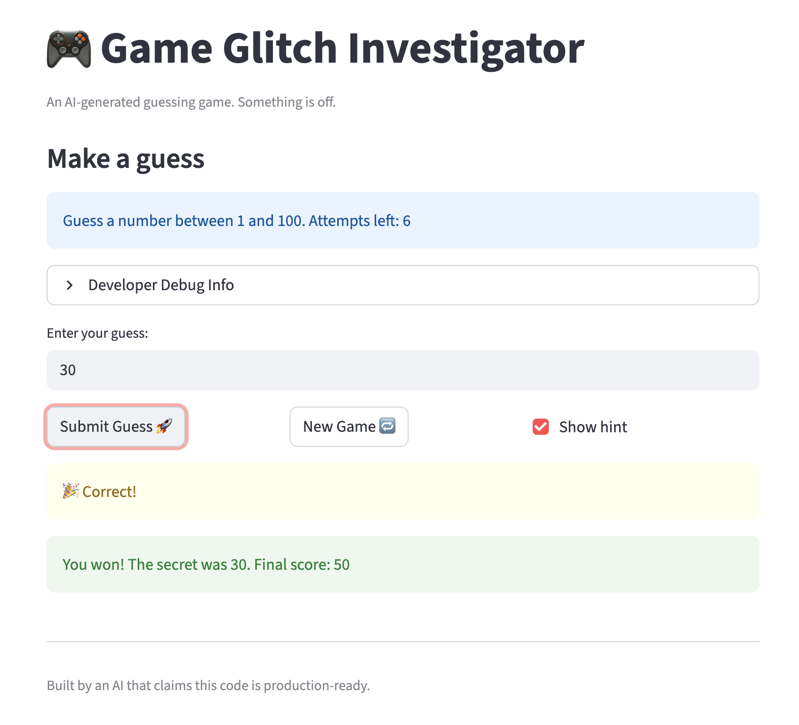
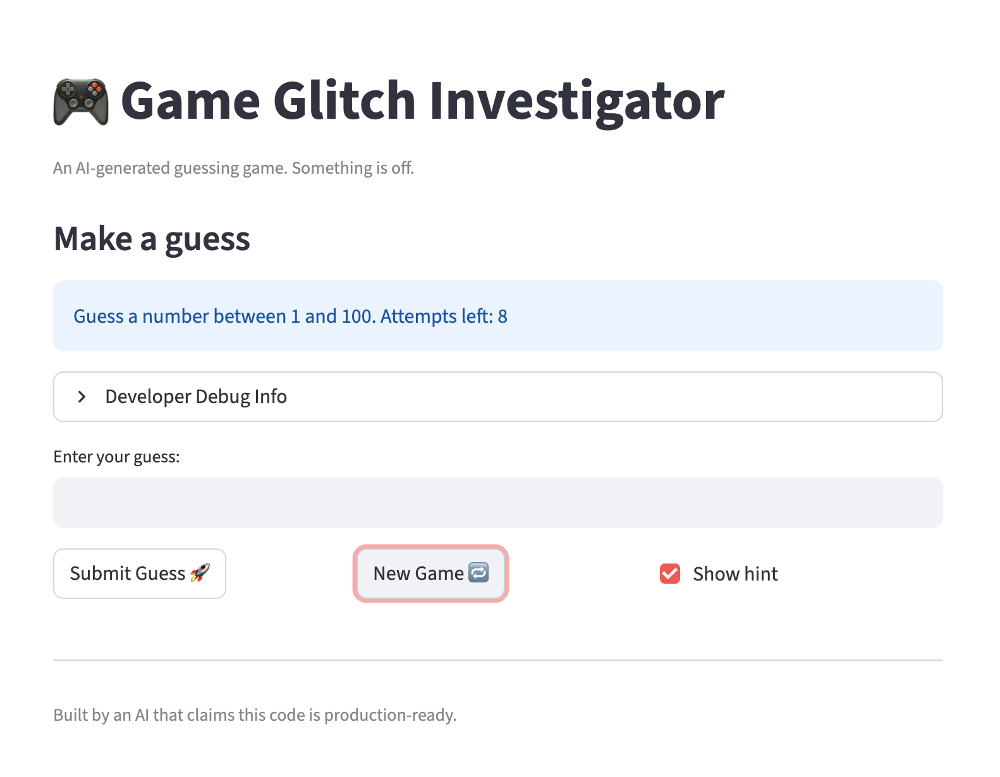
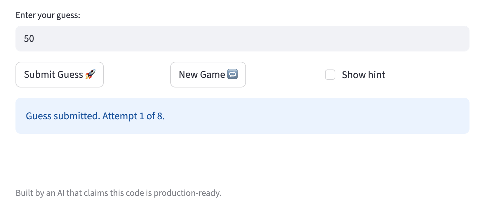

# 🎮 Game Glitch Investigator: The Impossible Guesser

## 🚨 The Situation

You asked an AI to build a simple "Number Guessing Game" using Streamlit.
It wrote the code, ran away, and now the game is unplayable. 

- You can't win.
- The hints lie to you.
- The secret number seems to have commitment issues.

## 🛠️ Setup

1. Install dependencies: `pip install -r requirements.txt`
2. Run the broken app: `python -m streamlit run app.py`

## 🕵️‍♂️ Your Mission

1. **Play the game.** Open the "Developer Debug Info" tab in the app to see the secret number. Try to win.
2. **Find the State Bug.** Why does the secret number change every time you click "Submit"? Ask ChatGPT: *"How do I keep a variable from resetting in Streamlit when I click a button?"*
3. **Fix the Logic.** The hints ("Higher/Lower") are wrong. Fix them.
4. **Refactor & Test.** - Move the logic into `logic_utils.py`.
   - Run `pytest` in your terminal.
   - Keep fixing until all tests pass!

## 📝 Document Your Experience

- [x] **Describe the game's purpose.**
  This is a number-guessing game built with Streamlit. The player picks a difficulty (Easy / Normal / Hard), which sets the secret number range and the attempt limit. Each round the player guesses a number; the game replies with "Too High", "Too Low", or "Correct!" and adjusts the score accordingly. The goal is to guess the secret number within the allowed attempts.

- [x] **Detail which bugs you found.**
  - **Bug 1 & 2 — New Game button broken after win or loss:** After winning or losing, clicking "New Game" appeared to do nothing. The game immediately showed the end-of-game message again and stopped.
  - **Bug 3 — No feedback when hint is hidden:** When the player unchecked "Show hint" and submitted a guess, nothing appeared on screen — no confirmation, no attempt count, no indication the guess was even registered.

- [x] **Explain what fixes you applied.**
  - **Bug 1 & 2:** The New Game handler was only resetting `attempts` and `secret` but never resetting `st.session_state.status` (which stayed `"won"` or `"lost"`). On the next rerun, the status check at the top of the page fired `st.stop()` immediately. Fix: also reset `status = "playing"`, `score = 0`, and `history = []` in the New Game handler.
  - **Bug 3:** Added an `else` branch to the hint display block. When `show_hint` is `False`, a neutral `st.info()` message now confirms the guess was submitted and shows the current attempt count.
  - **Refactor:** Moved all four game-logic functions (`get_range_for_difficulty`, `parse_guess`, `check_guess`, `update_score`) from `app.py` into `logic_utils.py` and imported them back. `app.py` now stays focused on UI; all testable logic lives in `logic_utils.py`.

## 📸 Demo

- [x] Winning the game (correct guess):

- [x] New Game button working after win/loss:

- [x] Notification shown when hint is hidden:

## 🚀 Stretch Features

- [ ] [If you choose to complete Challenge 4, insert a screenshot of your Enhanced Game UI here]
